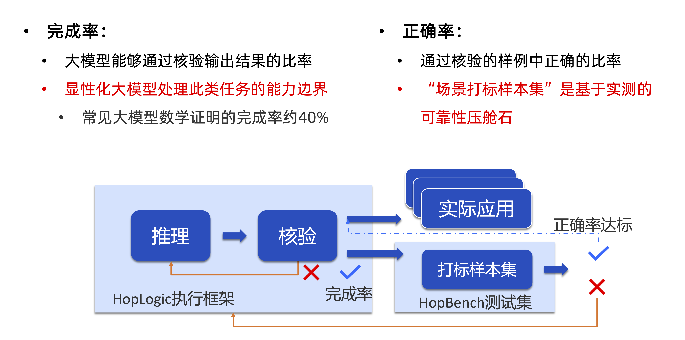

# HopLogic: 高阶程序执行框架

在大模型时代实现可靠、可核验、可扩展的业务自动化

<strong>HopLogic(High-Order Programming Logic)</strong>是一个革命性的高阶程序执行框架，通过结合程序化业务逻辑、领域知识图谱和工具链，解决大模型在专业领域应用中的幻觉问题，实现99%+可靠性的智能任务处理。
其中：
  * 业务逻辑程序化：即将SOP的主业务逻辑用程序语言表达，是领域积累的最佳实践的知识表达。HOP通过精确的程序化逻辑控制结构，避免自然语言带来的歧义与模糊性，实现专业领域所需的精确性；将复杂业务逻辑分拆到可核验的颗粒度，以支撑后继的高效核验；同时提供与编程语言类似的大规模可扩展能力。
  * 领域知识图谱：领域积累的概念关系的知识表达。业务逻辑中出现的自然语言描述的伪代码，与领域知识图谱一起，支持HOP执行时大模型所需的模糊知识概念的匹配与推导。
  * 工具链：负责具体的工具调用与执行。

# 核心特性
1. **技术特征**
  - workflow程序化，易于复用、扩展
  - 可靠性度量强化，控制错误扩散
  - 调用链的显性化，有效进行安全管控
  - 可靠性保障前提下的自动适配、迭代与演进
2. **与大模型的关系**
  - 更适合大模型的语言体系（工程＋智能）
  - 主攻推理阶段，对应积累也会有效帮助大模型的训练+执行体系的变革
3. **执行体系的变革**
  - 传统程序：CPU
  - HOP: CPU+ 大模型
    - 研发阶段：人的高频参与（L3辅助驾驶，人不离位）
    - 生产阶段：人的低频0参与（L4自动驾驶，偶尔唤起交互） 

# HOP架构概述

## 🚀 可执行
- **混合执行引擎**：结合传统CPU执行与大模型推理能力  
- **抽象概念处理**：超越传统程序的概念理解和逻辑推理能力  
- **规模化运行**：仅需资源即可无限扩展的执行能力  

## ✅ 可核验
- **复合核验体系**：
  - 确定性核验（Python代码验证、数学形式化核验）
      - 数学形式化核验：Lean具备精确表达数学概念和进行严谨的数学推理的能力，使用 Lean这类形式化语言 作为高度确定性的核验手段，为模型的输出提供反馈，使模型能够持续迭代和自我修正。
  - 逆向核验（大模型结果验证）
  - 正向交叉核验（多模型结果比对）
  - NLP要点核验（非结构化文本验证）
- **核验可靠性度量**：通过样本集持续评估和改进核验效果  
- **自动化重试机制**：核验失败自动触发重新执行  

## 🔄 可派生（逐步开放）
- **场景自适应**：将标准SOP自动适配到具体应用场景  
- **异常处理**：智能处理数据不足、异常和低质量输入  
- **派生程序核验**：独立模型验证派生程序的逻辑正确性  

## ⚙️ 可编排（逐步开放）
- **自洽执行单元**：每个HOP作为独立可编排组件  
- **高效工作流**：优化业务逻辑的执行顺序和资源分配  
- **动态编排**：根据执行结果实时调整工作流程 

# HOP示例场景落地
| 场景            | 模型           | baseline正确率（自然语言） | HOP完成率     | HOP正确率     |
| ------------- | ------------ | ----------------- | ---------- | ---------- |
| 8位大数相乘（自定义核验） | Qwen3-235B-A22B        | 0.3033            | 1.0000     | 0.9730     |
| 钓鱼邮件          | Qwen3-32B      |0.8432            | 0.9756    | 0.9901     |
| 医疗重复诊疗        | Qwen3-235B-A22B        | 0.7600            | 1.0000     | 0.9900     |

> 当前，钓鱼邮件检测与医疗重复诊疗的公开 benchmark 将于近期陆续发布。获取数据请直接提 Issue。

#### 指标介绍说明  
| 指标         | 含义               | 定义                     |
| ---------- | ---------------- | ---------------------- |
| **HOP完成率** | 大模型能够通过核验输出结果的比率 | 通过核验的样本数 / 样本总数        |
| **HOP正确率** | 通过核验的样例中正确的比率    | 通过核验且正确的样本数 / 通过核验的样本数 |

# HOP敏捷迭代：快速提升可靠性

# 如何使用
## Get Started
* [HOP安装说明文档](docs/hop_install.md)
* [HOP算子介绍与调用](docs/hop_operator.md)
* 通过案例快速上手
  * [HOP钓鱼邮件案例](docs/phishing_examples_guide.md)

	# 开源贡献
欢迎任何形式的贡献！待项目更加稳定后，我们将发布贡献指南并接受 Pull Request。

# License
[Mozilla Public License Version 2.0](LEGAL.md)

# 声明
非发布版本的HopLogic禁止在任何生产环境中使用，因为可能存在漏洞、故障、功能不足、安全问题或其他问题。
